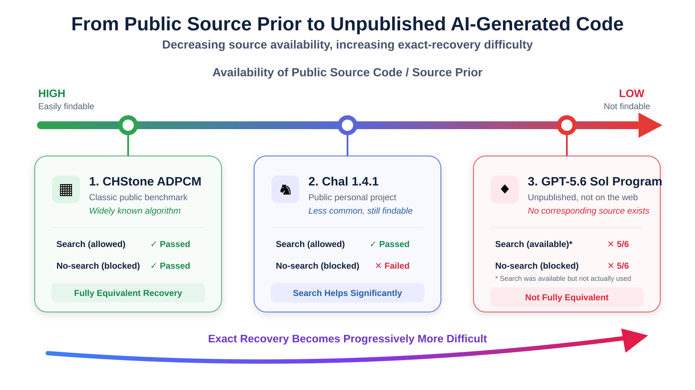

# ChatGPT Binary Decompilation Accuracy Experiment

[English](README.md) | [简体中文](README.zh-CN.md) | [Research notes / 实验研究记录](https://app.notion.com/p/3c5ba3506c39812a9cb3f371f9c76ef1)

A reproducible, multi-sample framework for measuring how accurately ChatGPT reconstructs C source code from optimized and stripped x86-64 Windows PE binaries. The experiment records recovered C produced with web search available and with search blocked, recompiles it without modification, and compares its observable behavior against the original challenge binary.

The current benchmark contains three samples with different levels of public source prior: the well-known CHStone ADPCM benchmark, the less common but searchable Chal chess engine, and an original synthetic ticket-portal program with no corresponding public source. This makes it possible to study the relationship between source availability and exact recovery instead of merely checking whether generated code compiles or approximates the original functionality.



Accuracy is determined only by compilation, linking, and deterministic behavioral tests. Source length, naming style, and reconstructed binary size are not scoring criteria.

## Samples

| Sample | Challenge binary | Original source | Deterministic tests |
|---|---|---|---|
| `adpcm` | `bin\challenge\sample_001.exe` | `source\original\adpcm.c` | Embedded CHStone vectors |
| `chal` | `bin\challenge\sample_002.exe` | `source\original\chal.c` | Four fixed FEN + depth perft cases |
| `portal` | `bin\challenge\sample_003.exe` | `source\original\ticket_portal.c` | Six fixed queries covering filtering, authorization, aggregation, detail output, and validation |

Neutral challenge filenames avoid revealing the algorithm or application name to the model under evaluation.

## Evaluation model

Each original source is compiled with pinned Clang/LLVM 22.1.8 for `x86_64-w64-windows-gnu` using `-O2`, no LTO, no debug information, function/data sections, dead-section elimination, and `llvm-strip --strip-all`.

For every test case, the framework runs the original challenge binary and records its exact:

- stdout bytes
- stderr bytes
- exit code
- timeout state
- crash state

These observations form the golden baseline. A recovered source passes only when its reconstructed binary matches the challenge binary on every recorded dimension for every case.

## Build challenges and golden baselines

Build all samples:

```bat
build_baseline
```

Build one sample without overwriting the existing manifest entries and artifacts for the others:

```bat
build_baseline --sample adpcm
build_baseline --sample chal
build_baseline --sample portal
```

Each sample independently produces a debug binary, an optimized and stripped challenge binary, a disassembly, and a baseline report.

Baseline reports are written to:

- `reports\baseline\adpcm\baseline_report.{md,json}`
- `reports\baseline\chal\baseline_report.{md,json}`
- `reports\baseline\portal\baseline_report.{md,json}`

## Evaluate recovered C

ADPCM remains the default sample for backward compatibility:

```bat
evaluate_recovered --source source\recovered\adpcm_recovered.c
```

Evaluate Chal:

```bat
evaluate_recovered --source source\recovered\chal_recovered.c --sample chal
```

Evaluate the synthetic Portal sample:

```bat
evaluate_recovered --source source\recovered\ticket_portal_recovered.c --sample portal
```

The evaluator never edits, repairs, or completes the recovered source. Compilation and linking are separate stages, and their complete stdout and stderr are retained in the run report.

Outputs are organized independently by sample:

- `bin\reconstructed\adpcm\<run-id>\adpcm_reconstructed.exe`
- `bin\reconstructed\chal\<run-id>\chal_reconstructed.exe`
- `bin\reconstructed\portal\<run-id>\ticket_portal_reconstructed.exe`
- `reports\reconstructed\adpcm\<run-id>\`
- `reports\reconstructed\chal\<run-id>\`
- `reports\reconstructed\portal\<run-id>\`

Each sample has its own `LATEST.txt`. The root `reports\reconstructed\LATEST.txt` points to the most recent evaluation across all samples for backward compatibility.

Possible classifications are `CANNOT_COMPILE`, `CANNOT_LINK`, `RUNTIME_CRASH`, `RUNTIME_TIMEOUT`, `STDOUT_MISMATCH`, `STDERR_MISMATCH`, `EXIT_CODE_MISMATCH`, and `ALL_TESTS_PASSED`.

## Reproducibility

`manifest.json` records each sample's provenance, source SHA-256, complete compile/link/strip/disassembly commands, and artifact hashes. Portal is explicitly identified as an original synthetic source. The pinned toolchain is `llvm-mingw 20260616 UCRT x86_64`, containing Clang/LLVM 22.1.8 and targeting `x86_64-w64-windows-gnu`.
